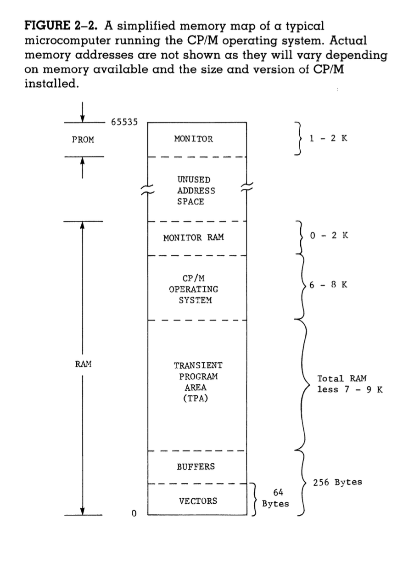

# Chapter 2

- Bootloader - loading program from memory (used to be entered manually)
- Firmware - software loaded into ROM
- Jumps to instruction 0 on restart - to "Shadow PROM"
- Monitor is run if there is a disk error running the bootstrap
- For disk and I/O operations, function codes are passed in one register, and data/addresses are passed in other registers
  - Using these functions creates portability (instead of using hardware specific addresses)
- Programs are loaded into the TPA (transient program area) as you run them
- Benefits of CP/M
  - Portability - programs can run on any CP/M system
  - Simplicity - simple interface for I/O and disk operations
  - Convenience - many useful programs available

